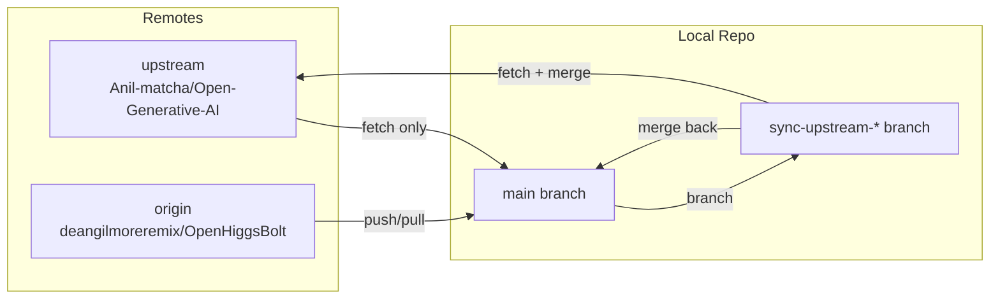
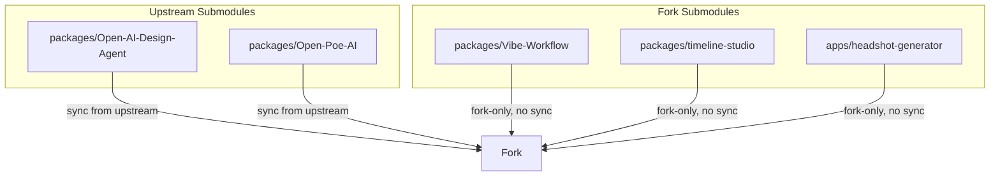
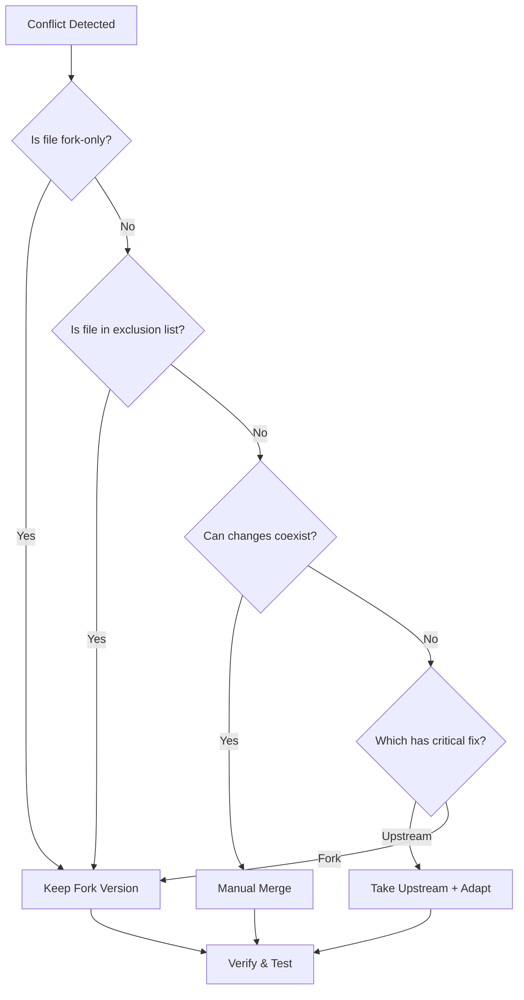

# Upstream Sync Runbook

## Table of Contents

1. [Overview](#1-overview)
2. [Architecture](#2-architecture)
3. [Initial Setup](#3-initial-setup)
4. [Manual Sync](#4-manual-sync)
5. [Automated Sync (GitHub Actions)](#5-automated-sync-github-actions)
6. [Handling Merge Conflicts](#6-handling-merge-conflicts)
7. [Rolling Back a Sync](#7-rolling-back-a-sync)
8. [File Sync Matrix](#8-file-sync-matrix)
9. [Risk Mitigation](#9-risk-mitigation)
10. [Troubleshooting](#10-troubleshooting)
11. [FAQ](#11-faq)

---

## 1. Overview

### Purpose

This runbook documents the strategy and procedures for syncing the OpenHiggsBolt fork with its upstream repository [`Anil-matcha/Open-Generative-AI`](https://github.com/Anil-matcha/Open-Generative-AI). The fork adds multi-tenant features (Clerk auth, Supabase, CutAI, brand management, etc.) on top of the upstream BYOK MuAPI client.

### Sync Philosophy

- **Selective sync**: Not all upstream changes are merged. Files that conflict with fork architecture (e.g., client-side key persistence, template marketplace) are intentionally excluded.
- **Preserve fork identity**: Local-only files (auth, new studios, API routes) are never overwritten by upstream.
- **Track sync points**: The `.upstream-sync` file records the last merged upstream commit hash for auditability.
- **Branch isolation**: All sync work happens on dedicated `sync-upstream-{date}` branches, never directly on `main`.

### Key Definitions

| Term | Definition |
|------|------------|
| **Upstream** | `https://github.com/Anil-matcha/Open-Generative-AI` — the original repo |
| **Origin (fork)** | `https://github.com/deangilmoreremix/OpenHiggsBolt` — this fork |
| **Sync point** | The upstream commit hash recorded in `.upstream-sync` after a successful merge |
| **Sync branch** | A temporary branch (`sync-upstream-YYYYMMDD`) used to stage and review upstream changes |

---

## 2. Architecture

### Sync Flow Diagram

```mermaid
flowchart TB
    subgraph Upstream["Upstream Repo"]
        U[Anil-matcha/Open-Generative-AI]
    end

    subgraph Fork["Fork Repo"]
        O[deangilmoreremix/OpenHiggsBolt]
    end

    subgraph Local["Local Machine"]
        L[Local Clone]
    end

    subgraph CI["GitHub Actions"]
        GH[Scheduled Sync Workflow]
    end

    U -- "git fetch upstream" --> L
    L -- "create sync branch" --> SB[sync-upstream-{date}]
    SB -- "cherry-pick / merge" --> M{Merge Strategy}
    M -- "included files" --> R[Review & Resolve Conflicts]
    M -- "excluded files" --> X[Skip — Fork-only]
    R -- "tests pass" --> PR[Pull Request]
    PR -- "merge to main" --> O
    GH -- "triggered weekly" --> SB
    O -- "update .upstream-sync" --> SP[.upstream-sync file]
```

### Remote Configuration



### Submodule Sync



---

## 3. Initial Setup

### Prerequisites

- Git 2.30+
- GitHub CLI (`gh`) installed and authenticated
- Write access to `deangilmoreremix/OpenHiggsBolt`

### Step 1: Verify Remotes

```bash
cd /path/to/OpenHiggsBolt
git remote -v
```

Expected output:

```
origin    https://github.com/deangellgilmoreemix/OpenHiggsBolt.git (fetch)
origin    https://github.com/deangilmoreremix/OpenHiggsBolt.git (push)
upstream  https://github.com/Anil-matcha/Open-Generative-AI.git (fetch)
upstream  https://github.com/Anil-matcha/Open-Generative-AI.git (push)
```

### Step 2: Add Upstream Remote (if missing)

```bash
git remote add upstream https://github.com/Anil-matcha/Open-Generative-AI.git
```

### Step 3: Fetch Upstream

```bash
git fetch upstream
```

### Step 4: Check Current Sync Point

```bash
cat .upstream-sync
# Example output: 6134bc6
```

### Step 5: Verify Branch Protection

Ensure `main` branch protection is enabled on the fork:

1. Go to `https://github.com/deangilmoreremix/OpenHiggsBolt/settings/branches`
2. Confirm `main` requires pull request reviews before merging
3. Confirm `main` requires status checks to pass

---

## 4. Manual Sync

### When to Run Manual Sync

- Upstream has critical bug fixes or security patches
- Before a major fork release to capture recent upstream improvements
- When automated sync fails and needs manual intervention

### Step-by-Step Manual Sync

#### 1. Prepare

```bash
# Ensure clean working tree
git status
git checkout main
git pull origin main
```

#### 2. Create Sync Branch

```bash
DATE=$(date +%Y%m%d)
git checkout -b sync-upstream-$DATE
```

#### 3. Fetch Upstream Changes

```bash
git fetch upstream
```

#### 4. Identify New Commits

```bash
# View commits since last sync
SYNC_POINT=$(cat .upstream-sync)
git log $SYNC_POINT..upstream/main --oneline
```

#### 5. Merge Upstream

```bash
git merge upstream/main --no-commit --no-ff
```

The `--no-commit` flag stages changes without committing, allowing review before finalizing.

#### 6. Apply File Sync Matrix

Review staged changes and handle according to the [File Sync Matrix](#8-file-sync-matrix):

```bash
# See what's staged
git diff --cached --name-only

# For files that should NOT sync (fork-only or intentionally excluded):
git reset HEAD packages/studio/src/persistKey.js
git checkout -- packages/studio/src/persistKey.js

# For files that conflict with fork changes, cherry-pick specific hunks:
git checkout -p HEAD -- packages/studio/src/muapi.js
```

#### 7. Run Tests

```bash
npm install
npm run lint
npm run typecheck
npm test
```

#### 8. Commit and Push

```bash
# Record the new sync point
NEW_SYNC_POINT=$(git rev-parse upstream/main)
echo $NEW_SYNC_POINT > .upstream-sync

# Commit
git add .upstream-sync
git commit -m "chore: sync upstream to $NEW_SYNC_POINT"

# Push sync branch
git push origin sync-upstream-$DATE
```

#### 9. Create Pull Request

```bash
gh pr create \
  --title "sync: upstream $(date +%Y-%m-%d)" \
  --body "## Upstream Sync

- Sync point: $NEW_SYNC_POINT
- Previous: $SYNC_POINT
- Changes: $(git log $SYNC_POINT..upstream/main --oneline | wc -l) commits

### Excluded Files
- List any files intentionally excluded

### Test Results
- [ ] lint passes
- [ ] typecheck passes
- [ ] tests pass
- [ ] manual smoke test" \
  --base main \
  --head sync-upstream-$DATE
```

#### 10. Merge After Review

```bash
gh pr merge --squash --delete-branch
```

---

## 5. Automated Sync (GitHub Actions)

### Workflow Overview

The automated sync runs on a schedule and creates a PR when upstream has new commits.

### Schedule

- **Frequency**: Weekly (every Monday at 00:00 UTC)
- **Trigger**: `workflow_dispatch` for manual runs

### Workflow File

Create `.github/workflows/upstream-sync.yml`:

```yaml
name: Upstream Sync

on:
  schedule:
    - cron: '0 0 * * 1'  # Every Monday at 00:00 UTC
  workflow_dispatch:
    inputs:
      force_sync:
        description: 'Force sync even if no new commits'
        required: false
        default: 'false'
        type: boolean

permissions:
  contents: write
  pull-requests: write

jobs:
  sync:
    runs-on: ubuntu-latest
    steps:
      - name: Checkout fork
        uses: actions/checkout@v4
        with:
          fetch-depth: 0
          token: ${{ secrets.GITHUB_TOKEN }}

      - name: Configure Git
        run: |
          git config user.name "github-actions[bot]"
          git config user.email "github-actions[bot]@users.noreply.github.com"

      - name: Add upstream remote
        run: |
          git remote add upstream https://github.com/Anil-matcha/Open-Generative-AI.git || true
          git fetch upstream

      - name: Check for new commits
        id: check
        run: |
          SYNC_POINT=$(cat .upstream-sync 2>/dev/null || echo "none")
          UPSTREAM_HEAD=$(git rev-parse upstream/main)
          echo "sync_point=$SYNC_POINT" >> $GITHUB_OUTPUT
          echo "upstream_head=$UPSTREAM_HEAD" >> $GITHUB_OUTPUT

          if [ "$SYNC_POINT" = "$UPSTREAM_HEAD" ] && [ "${{ inputs.force_sync }}" != "true" ]; then
            echo "has_changes=false" >> $GITHUB_OUTPUT
            echo "No new upstream commits since $SYNC_POINT"
          else
            echo "has_changes=true" >> $GITHUB_OUTPUT
            echo "New commits found: $SYNC_POINT..$UPSTREAM_HEAD"
          fi

      - name: Create sync branch
        if: steps.check.outputs.has_changes == 'true'
        run: |
          DATE=$(date +%Y%m%d)
          git checkout -b sync-upstream-$DATE

      - name: Merge upstream
        if: steps.check.outputs.has_changes == 'true'
        run: |
          git merge upstream/main --no-commit --no-ff || true

      - name: Apply exclusions
        if: steps.check.outputs.has_changes == 'true'
        run: |
          # Restore fork-only files that upstream may have modified
          git checkout HEAD -- \
            middleware.js \
            clerkAppearance.js \
            packages/studio/src/persistKey.js \
            app/sign-in/ \
            app/sign-up/ \
            app/forgot-password/ \
            app/api/webhooks/ \
            app/api/auth/ \
            app/api/design-agent/ \
            app/api/photo-studio/ \
            app/api/storyboard/ \
            app/api/thumbnail/ \
            app/api/vfx/ \
            app/api/brand/ \
            app/api/brands/ \
            app/api/workspace/ \
            supabase/ \
            src/apps/ \
            apps/cutai/ \
            e2e/ \
            tests/ \
            2>/dev/null || true

      - name: Check for conflicts
        if: steps.check.outputs.has_changes == 'true'
        id: conflicts
        run: |
          CONFLICTS=$(git diff --name-only --diff-filter=U)
          if [ -n "$CONFLICTS" ]; then
            echo "has_conflicts=true" >> $GITHUB_OUTPUT
            echo "conflicts<<EOF" >> $GITHUB_OUTPUT
            echo "$CONFLICTS" >> $GITHUB_OUTPUT
            echo "EOF" >> $GITHUB_OUTPUT
          else
            echo "has_conflicts=false" >> $GITHUB_OUTPUT
          fi

      - name: Abort on conflicts
        if: steps.check.outputs.has_changes == 'true' && steps.conflicts.outputs.has_conflicts == 'true'
        run: |
          git merge --abort
          echo "::error::Merge conflicts detected. Manual resolution required."
          echo "Conflicted files:"
          echo "${{ steps.conflicts.outputs.conflicts }}"
          exit 1

      - name: Record sync point
        if: steps.check.outputs.has_changes == 'true' && steps.conflicts.outputs.has_conflicts == 'false'
        run: |
          NEW_SYNC_POINT=$(git rev-parse upstream/main)
          echo $NEW_SYNC_POINT > .upstream-sync
          git add .upstream-sync
          git commit -m "chore: automated upstream sync to $NEW_SYNC_POINT"

      - name: Push and create PR
        if: steps.check.outputs.has_changes == 'true' && steps.conflicts.outputs.has_conflicts == 'false'
        run: |
          DATE=$(date +%Y%m%d)
          git push origin sync-upstream-$DATE

          gh pr create \
            --title "sync: automated upstream $(date +%Y-%m-%d)" \
            --body "## Automated Upstream Sync

            - Sync point: $(cat .upstream-sync)
            - Previous: ${{ steps.check.outputs.sync_point }}
            - Commits: $(git log ${{ steps.check.outputs.sync_point }}..upstream/main --oneline | wc -l)

            ### Action Required
            - [ ] Review changes
            - [ ] Run tests locally if needed
            - [ ] Merge when ready" \
            --base main \
            --head sync-upstream-$DATE
        env:
          GITHUB_TOKEN: ${{ secrets.GITHUB_TOKEN }}
```

### Monitoring Automated Sync

- Check workflow runs at: `https://github.com/deangilmoreremix/OpenHiggsBolt/actions/workflows/upstream-sync.yml`
- Failed syncs create GitHub issues automatically (add notification step if desired)

---

## 6. Handling Merge Conflicts

### Common Conflict Scenarios

| Scenario | Cause | Resolution |
|----------|-------|------------|
| `muapi.js` modified in both | Fork added server-side key logic; upstream changed client calls | Keep fork changes; manually port upstream logic |
| `VideoStudio.jsx` conflicts | Fork restructured generation flow | Preserve fork structure; cherry-pick upstream bug fixes |
| `package.json` diverged | Different dependencies | Merge both; run `npm install` to resolve lockfile |
| Submodule pointer conflicts | Submodule commits differ | Update submodule separately; don't override pointer |
| Deleted file modified upstream | Fork removed file upstream still edits | Re-delete after merge; document in commit |

### Conflict Resolution Workflow

```bash
# 1. Start merge (conflicts expected)
git merge upstream/main

# 2. List conflicted files
git diff --name-only --diff-filter=U

# 3. For each conflicted file, choose strategy:
#    Option A: Keep fork version entirely
git checkout --ours path/to/file

#    Option B: Take upstream version entirely
git checkout --theirs path/to/file

#    Option C: Manual merge (open in editor)
code path/to/file  # resolve markers, then:
git add path/to/file

# 4. After all conflicts resolved
git add .
git commit -m "merge: resolve upstream conflicts"

# 5. Verify nothing broke
npm run lint && npm test
```

### Conflict Resolution Decision Tree



---

## 7. Rolling Back a Sync

### When to Roll Back

- Sync introduced a regression that can't be quickly fixed
- Critical production issue traced to upstream merge
- Merge was performed without proper review

### Rollback Methods

#### Method 1: Revert the Merge Commit (Recommended)

```bash
# Find the merge commit
git log --oneline --merges -10

# Revert the merge (preserves history)
git revert -m 1 <merge-commit-hash>

# Push the revert
git push origin main
```

#### Method 2: Reset to Pre-Sync State (Destructive)

```bash
# Create backup branch first
git branch backup/pre-rollback-$(date +%Y%m%d) main

# Reset to commit before sync
git reset --hard <pre-sync-commit-hash>

# Force push (requires admin)
git push origin main --force-with-lease
```

#### Method 3: Restore Specific Files

```bash
# Restore a single file from before sync
git checkout <pre-sync-commit-hash> -- path/to/file
git commit -m "revert: restore path/to/file to pre-sync state"
```

### Post-Rollback Steps

1. Update `.upstream-sync` to the pre-sync commit hash
2. Create a tracking issue for re-attempting the sync
3. Document the reason for rollback
4. Add tests to prevent the regression

---

## 8. File Sync Matrix

### Files That Sync From Upstream

| Path | Sync Behavior | Notes |
|------|---------------|-------|
| `packages/studio/src/muapi.js` | Merge carefully | Core MuAPI client; fork has server-side key additions |
| `packages/studio/src/models.js` | Auto-merge | Model catalog; regenerated by MUAPI sync |
| `packages/studio/src/components/*.jsx` | Review each | Some components removed in fork |
| `packages/studio/src/utils/*.js` | Auto-merge | Shared utilities |
| `src/lib/*.js` | Auto-merge | Upload history, pending jobs, local inference |
| `src/components/*.jsx` | Review each | Core studio components |
| `app/api/v1/[[...path]]/route.js` | Preserve | Proxy route; kept as safety net |
| `docs/` | Selective | Skip fork-specific docs |
| `package.json` | Merge | Combine dependencies |
| `README.md` | Keep fork | Fork has different README |

### Files That Are Local-Only (Never Overwritten)

| Path | Reason |
|------|--------|
| `middleware.js` | Clerk auth middleware |
| `clerkAppearance.js` | Clerk UI theming |
| `app/sign-in/` | Clerk sign-in pages |
| `app/sign-up/` | Clerk sign-up pages |
| `app/forgot-password/` | Clerk password recovery |
| `app/api/webhooks/clerk/` | Clerk webhook handler |
| `app/api/auth/` | Auth API routes |
| `app/api/design-agent/` | Design agent backend |
| `app/api/photo-studio/` | Photo studio backend |
| `app/api/storyboard/` | Storyboard backend |
| `app/api/thumbnail/` | Thumbnail backend |
| `app/api/vfx/` | VFX backend |
| `app/api/brand/` | Brand management backend |
| `app/api/workspace/` | Workspace provisioning |
| `supabase/` | Database migrations |
| `src/apps/cinema/` | Cinema studio |
| `src/apps/design-agent/` | Design agent UI |
| `src/apps/social-publishing/` | Social publishing |
| `src/apps/storyboard/` | Storyboard tool |
| `src/apps/thumbnail-studio/` | Thumbnail studio |
| `src/apps/vfx-studio/` | VFX studio |
| `app/brand-studio/` | Brand studio pages |
| `app/photo-studio/` | Photo studio pages |
| `app/vfx/` | VFX pages |
| `app/account/` | Account page |
| `apps/cutai/` | CutAI application |
| `e2e/` | E2E tests |
| `tests/` | Unit tests |
| `components/landing/` | Landing page components |
| `hooks/useVideoGeneration.js` | Custom hooks |
| `lib/muapi.js` | VFX-focused MuAPI client |
| `scripts/invite-users.mjs` | User invitation script |
| `docs/superpowers/` | Planning docs |

### Intentionally Existed Upstream Files

These upstream files are deliberately NOT present in the fork:

| Upstream File | Reason Removed |
|---------------|----------------|
| `packages/studio/src/components/AppsStudio.jsx` | Template marketplace out of scope |
| `packages/studio/src/components/MobileGenerationActions.jsx` | Mobile UI consolidated |
| `packages/studio/src/components/prompt/PromptComposer.jsx` | Replaced by per-studio prompts |
| `packages/studio/src/components/prompt/README.md` | Docs for removed component |
| `packages/studio/src/persistKey.js` | Client-side key storage replaced by server-side |
| `packages/studio/src/utils/formatError.js` | Different error handling in fork |
| `app/api/v1/upload-binary/route.js` | Dead duplicate |
| `docs/assets/video-23-thumbnail*.png` | Orphaned assets |
| `thumbnail-ai-v2-1920x1080.png` | Orphaned asset |
| `thumbnail.png` | Orphaned asset |
| `video-27-minimax-hailuo-h3-guide-v3.png` | Orphaned asset |

### Submodule Sync Status

| Submodule | Source | Sync From Upstream |
|-----------|--------|-------------------|
| `packages/Open-AI-Design-Agent` | `Anil-matcha/Open-AI-Design-Agent` | Yes |
| `packages/Open-Poe-AI` | `Anil-matcha/Open-Poe-AI` | Yes |
| `packages/Vibe-Workflow` | `deangilmoreremix/Vibe-Workflow` | No (fork-only) |
| `packages/timeline-studio` | `deangilmoreremix/timeline-studio` | No (fork-only) |
| `apps/headshot-generator` | `deangilmoreremix/ai-headshot-generator` | No (fork-only) |

---

## 9. Risk Mitigation

### Risk Register

| Risk | Likelihood | Impact | Mitigation |
|------|------------|--------|------------|
| Upstream introduces breaking API changes | Medium | High | Pin to specific sync points; test before merge |
| Merge conflict in core file (`muapi.js`) | High | Medium | Documented resolution patterns; always manual review |
| Upstream removes dependency fork relies on | Low | High | Lock dependency versions; audit before sync |
| Automated sync creates broken PR | Medium | Medium | Require CI checks; branch protection rules |
| Submodule pointer conflict | Medium | Medium | Separate submodule sync step; verify after merge |
| Fork-only file accidentally overwritten | Low | High | Exclusion list in sync script; pre-merge diff review |
| Upstream license change | Low | Critical | Monitor LICENSE file; legal review if changed |

### Preventive Measures

1. **Branch Protection**: `main` requires PR + status checks
2. **Pre-sync Backup**: Always create backup branch before sync
3. **Test Suite**: Run full test suite after every sync
4. **Staged Rollout**: Sync to staging branch before `main`
5. **Sync Point Tracking**: `.upstream-sync` prevents duplicate work
6. **Exclusion List**: Hardcoded in sync script to prevent accidental overwrites

### Emergency Contacts

- Fork maintainer: `@deangilmoreremix`
- Upstream: Open issue at `Anil-matcha/Open-Generative-AI`

---

## 10. Troubleshooting

### Common Issues

#### Issue: `fatal: 'upstream' does not appear to be a git repository`

**Cause**: Upstream remote not configured.

**Fix**:
```bash
git remote add upstream https://github.com/Anil-matcha/Open-Generative-AI.git
git fetch upstream
```

#### Issue: `error: Your local changes would be overwritten by merge`

**Cause**: Uncommitted local changes.

**Fix**:
```bash
git stash
git merge upstream/main
git stash pop
```

#### Issue: Merge conflicts in `package-lock.json`

**Fix**:
```bash
git checkout --theirs package-lock.json
npm install
git add package-lock.json
git commit
```

#### Issue: Submodule shows modified content after sync

**Fix**:
```bash
git submodule update --init --recursive
```

#### Issue: `.upstream-sync` file has wrong commit

**Fix**:
```bash
# Get correct upstream HEAD
git fetch upstream
echo $(git rev-parse upstream/main) > .upstream-sync
git add .upstream-sync
git commit -m "chore: correct upstream sync point"
```

#### Issue: Sync branch already exists

**Fix**:
```bash
# Delete local and remote branch, then recreate
git branch -D sync-upstream-20260101
git push origin --delete sync-upstream-20260101
git checkout -b sync-upstream-20260101
```

#### Issue: Tests fail after sync

**Fix**:
```bash
# Identify failing tests
npm test 2>&1 | tee test-output.log

# Check if failure is from upstream changes
git diff HEAD~1 --name-only

# Revert specific problematic files
git checkout HEAD~1 -- path/to/file
npm test
```

### Diagnostic Commands

```bash
# View sync history
git log --oneline --all --grep="upstream"

# Compare fork vs upstream
git diff main..upstream/main --stat

# See what files differ
git diff main..upstream/main --name-only

# Check submodule status
git submodule status

# View last sync point
cat .upstream-sync

# Verify remote URLs
git remote -v
```

---

## 11. FAQ

### General

**Q: How often should we sync?**
A: Weekly automated sync is recommended. Manual syncs should happen when upstream has critical fixes or before a fork release.

**Q: Can we automate the entire sync?**
A: Full automation is risky due to frequent conflicts in core files. The recommended approach is automated PR creation with manual review and conflict resolution.

**Q: What if upstream rebases or force-pushes?**
A: Sync is based on commit hashes, not branch state. If upstream force-pushes, identify the new HEAD and sync from the last known good commit point.

### Conflicts

**Q: How do I know which version to keep during a conflict?**
A: Refer to the [File Sync Matrix](#8-file-sync-matrix). Fork-only files always keep the fork version. For shared files, prefer upstream bug fixes but preserve fork architectural changes.

**Q: What if a conflict is too complex to resolve?**
A: Abort the merge, create an issue, and cherry-pick only the specific upstream commits that are needed:
```bash
git merge --abort
git cherry-pick <specific-commit-hash>
```

### Submodules

**Q: Do submodules sync automatically?**
A: No. Submodules must be updated separately. Run `git submodule update --remote` for upstream-sourced submodules.

**Q: How do I update a submodule?**
A:
```bash
cd packages/Open-AI-Design-Agent
git fetch origin
git checkout origin/main
cd ../..
git add packages/Open-AI-Design-Agent
git commit -m "chore: update Open-AI-Design-Agent submodule"
```

### Rollback

**Q: How far back can we roll back?**
A: Any previous state is recoverable via git. Use `git reflog` to find the exact pre-sync state.

**Q: Does reverting a sync remove it from history?**
A: No. `git revert` creates a new commit that undoes changes. Use `git reset` (with caution) to remove from history.

### Automation

**Q: Can the sync workflow send Slack notifications?**
A: Yes. Add a Slack notification step to the workflow using `slackapi/slack-github-action`.

**Q: What happens if the automated sync workflow fails?**
A: The workflow will show as failed in GitHub Actions. No PR is created. Manual intervention is required to diagnose and resolve.

---

## Appendix A: Quick Command Reference

```bash
# Check current sync status
cat .upstream-sync && git fetch upstream && git log $(cat .upstream-sync)..upstream/main --oneline

# Quick sync check (dry run)
git merge upstream/main --no-commit --no-ff && git merge --abort

# Full manual sync
git checkout main && git pull origin main
git checkout -b sync-upstream-$(date +%Y%m%d)
git fetch upstream
git merge upstream/main --no-commit --no-ff
# ... resolve conflicts, apply exclusions ...
echo $(git rev-parse upstream/main) > .upstream-sync
git add .upstream-sync && git commit
git push origin sync-upstream-$(date +%Y%m%d)
gh pr create --title "sync: upstream $(date +%Y-%m-%d)" --base main --head sync-upstream-$(date +%Y%m%d)
```

## Appendix B: Sync Checklist

Use this checklist for every sync:

- [ ] Working tree is clean (`git status`)
- [ ] On `main` branch, up to date with origin
- [ ] Created sync branch with date suffix
- [ ] Fetched latest upstream
- [ ] Reviewed upstream commits since last sync
- [ ] Merged with `--no-commit` for review
- [ ] Applied file exclusions per sync matrix
- [ ] Resolved all merge conflicts
- [ ] Ran `npm run lint`
- [ ] Ran `npm run typecheck`
- [ ] Ran `npm test`
- [ ] Updated `.upstream-sync` with new commit hash
- [ ] Pushed sync branch to origin
- [ ] Created PR with change summary
- [ ] PR reviewed and approved
- [ ] Merged via squash
- [ ] Deleted sync branch
- [ ] Verified production deployment
